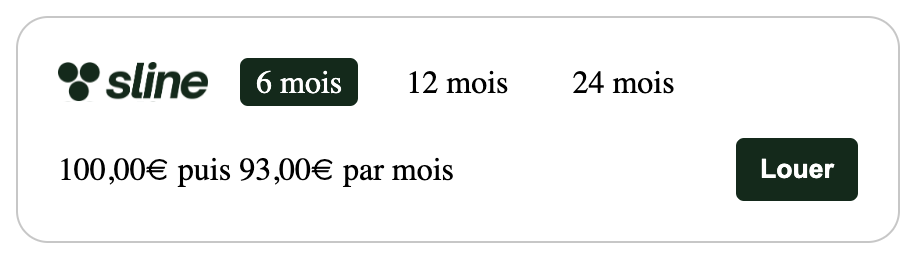

# Sline Web SDK V3 - Documentation

## Démarrage rapide

### Installation

Rajoutez les balises suivantes à la fin de la section `<head>` de votre page :

```html
<link
  rel="stylesheet"
  href="https://cdn.jsdelivr.net/gh/sline-io/web-sdk-v3@latest/dist/sline.css"
/>
<script
  type="text/javascript"
  src="https://cdn.jsdelivr.net/gh/sline-io/web-sdk-v3@latest/dist/sline.umd.js"
></script>
```

### Initialisation

Dans le code JavaScript de votre application, initialisez le SDK avec vos informations :

```js
Sline.initialize({
  clientId: "{{ YOUR_CLIENT_ID }}",
  clientSecret: "{{ YOUR_CLIENT_SECRET}}",
  test: true, // retirer ce paramètre si vous êtes en production
});
```

### Ajout d'un badge Sline

Pour ajouter badge de checkout Sline sur votre page, créer un conteneur avec un identifiant (ici `#container`) :

```html
<div id="container"></div>
```

Puis, utiliser la méthode `addCheckoutBadge` :

```js
Sline.addCheckoutBadge("container", {
  lineItems: [
    {
      name: "Macbook Pro",
      item_type: "physical",
      unit_price: 129900,
      quantity: 1,
      rent: true,
      // Retrouver tous les champs disponibles plus bas
    },
  ],
});
```

Ainsi, un badge se chargera en fonction des produits que vous avez renseignés.



### Modifier des informations

Vous pouvez ajouter des informations sur le client :

```js
Sline.setCustomer({
  gender: "male",
  first_name: "Prénom",
  last_name: "Nom de famille",
  email: "email@domain.com",
  phone: "+336000000000",
  date_of_birth: "1990-01-01",
  customer_type: "person",
});
```

Vous pouvez ajouter des informations de livraison :

```js
Sline.setShippingAddress({
  street_address: "..",
  street_address_2: "...",
  zip_code: "...",
  city: "...",
  region: "...",
  country: "...",
});
```

Vous pouvez ajouter des informations de facturation :

```js
Sline.setBillingAddress({
  street_address: "..",
  street_address_2: "...",
  zip_code: "...",
  city: "...",
  region: "...",
  country: "...",
});
```

## Réferences

## Méthodes

### Ajout d'un badge (`addCheckoutBadge`)

```ts
Sline.addCheckoutBadge(
  containerId: string,
  { retailerId: string, lineItems: LineItem[] }
) => void;
```

Cette méthode ajoute un badge dans le conteneur identifié par `containerId` dans votre page. Si le conteneur est introuvable, une erreur est lancée.

Retrouver tous les champs disponibles pour la liste des produits (`lineItems`) en [cliquant ici](#produit-lineitem).

**Pour mettre à jour un badge,** utiliser simplement cette méthode une nouvelle fois, avec la liste des produits mis à jour.

### Retirer un badge (`removeCheckoutBadge`)

```ts
Sline.removeCheckoutBadge(containerId: string) => void;
```

Cette méthode retire le badge situé dans le conteneur identifié par `containerId`.

### Modifier les informations du client (`setCustomer`)

```ts
Sline.setCustomer(customer: Customer | undefined) => void;
```

Cette méthode permet d'enregistrer les informations d'un client. Pour retirer toutes les informations du client vous pouvez appelez `Sline.setCustomer(undefined)`.

Retrouver tous les champs disponibles pour un client (`customer`) en [cliquant ici](#client-customer).

### Modifier les informations de livraison (`setShippingAddress`)

```ts
Sline.setShippingAddress(shippingAddress: Address | undefined) => void;
```

Cette méthode permet d'enregistrer les informations de livraison du client. Pour retirer toutes les informations de livraison vous pouvez appelez `Sline.setShippingAddress(undefined)`.

Retrouver tous les champs disponibles pour l'adresse de livraison (`shippingAddress`) en [cliquant ici](#adresse-address).

### Modifier les informations de facturation (`setBillingAddress`)

```ts
Sline.setBillingAddress(billingAddress: Address | undefined) => void;
```

Cette méthode permet d'enregistrer les informations de facturation du client. Pour retirer toutes les informations de facturation vous pouvez appelez `Sline.setBillingAddress(undefined)`.

Retrouver tous les champs disponibles pour l'adresse de facturation (`billingAddress`) en [cliquant ici](#adresse-address).

## Valeurs

### Produit (`LineItem`)

| Champ                         | Type                                                | Description                                                  | Obligatoire |
| ----------------------------- | --------------------------------------------------- | ------------------------------------------------------------ | ----------- |
| `item_type`                   | `"physical" \| "shipping" \| "coupon" \| "service"` | Type de produit                                              | Oui ⚠️      |
| `unit_price`                  | `number`                                            | Prix du produit en centimes (hors taxe)                      | Oui ⚠️      |
| `quantity`                    | `number`                                            | Quantité du produit                                          | Oui ⚠️      |
| `rent`                        | `boolean`                                           | Le produit est élligible à la location                       | Oui ⚠️      |
| `msrp`                        | `number`                                            | Le prix recommandé par le fabricant d'un produit en centimes | Non         |
| `product_value`               | `number`                                            | Valeur du produit en centimes                                | Non         |
| `coverage_configuration_code` | `string`                                            | Code de configuration des garanties (cf. back-office)        | Non         |
| `pricing_configuration_code`  | `string`                                            | Code de configuration des prix (cf. back-office)             | Non         |
| `name`                        | `string`                                            | Nom du produit                                               | Non         |
| `reference`                   | `string`                                            | Référence du produit                                         | Non         |
| `image`                       | `string`                                            | URL de l'image du produit                                    | Non         |
| `product_url`                 | `string`                                            | URL de la fiche produit                                      | Non         |
| `brand`                       | `string`                                            | Marque du produit                                            | Non         |
| `category_path`               | `string`                                            | Catégorie du produit                                         | Non         |
| `item_variant`                | `string`                                            | Variante du produit                                          | Non         |
| `description`                 | `string`                                            | Description du produit                                       | Non         |
| `global_trade_item_number`    | `string`                                            | Identifiant unique international du produit                  | Non         |
| `manufacturer_part_number`    | `string`                                            | Identifiant unique du fabricant                              | Non         |
| `merchant_data`               | `string`                                            | Champ libre                                                  | Non         |

### Client (`Customer`)

| Champ                     | Type                    | Description                                          | Obligatoire |
| ------------------------- | ----------------------- | ---------------------------------------------------- | ----------- |
| `gender`                  | `"male" \| "female"`    | Genre du client                                      | Non         |
| `first_name`              | `string`                | Prénom du client                                     | Non         |
| `last_name`               | `string`                | Nom du client                                        | Non         |
| `email`                   | `string`                | Email du client                                      | Non         |
| `phone`                   | `string`                | Téléphone du client                                  | Non         |
| `date_of_birth`           | `string`                | Date de naissance du client (de la forme YYYY-MM-DD) | Non         |
| `customer_type`           | `"person" \| "company"` | Type de client (particulier ou entreprise)           | Non         |
| `company_name`            | `string`                | Nom de l'entreprise du client                        | Non         |
| `company_registration_id` | `string`                | Numéro SIREN de l'entreprise du client               | Non         |
| `company_vat_id`          | `string`                | Numéro de TVA de l'entreprise du client              | Non         |

### Adresse (`Address`)

| Champ              | Type                 | Description                   | Obligatoire |
| ------------------ | -------------------- | ----------------------------- | ----------- |
| `street_address`   | `string`             | Adresse                       | Non         |
| `street_address_2` | `string`             | Complément d'adresse          | Non         |
| `zip_code`         | `string`             | Code postal                   | Non         |
| `city`             | `string`             | Ville                         | Non         |
| `region`           | `string`             | Région                        | Non         |
| `country`          | `string`             | **Code** du pays (ISO)        | Non         |
| `gender`           | `"male" \| "female"` | Genre du client               | Non         |
| `first_name`       | `string`             | Prénom du client              | Non         |
| `last_name`        | `string`             | Nom du client                 | Non         |
| `email`            | `string`             | Email du client               | Non         |
| `phone`            | `string`             | Téléphone du client           | Non         |
| `company_name`     | `string`             | Nom de l'entreprise du client | Non         |
